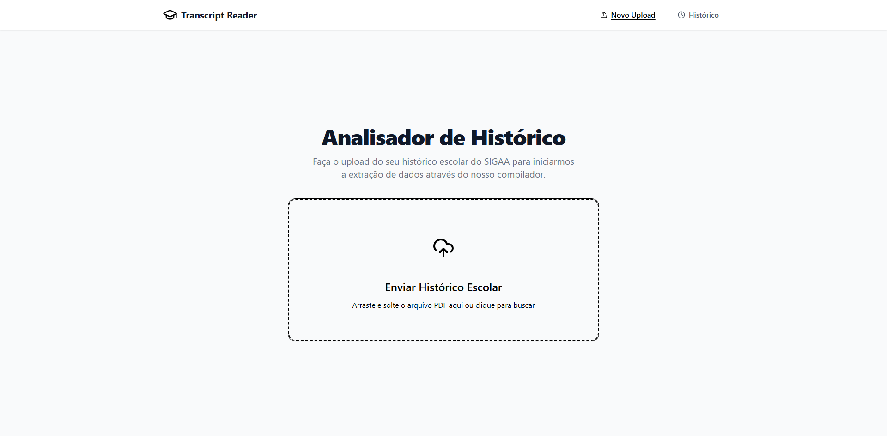

# School Transcript Reader

Este repositório contém um projeto completo (Full-stack) para a leitura, análise e estruturação de históricos escolares do SIGAA, aplicando conceitos práticos da disciplina de Compiladores.

O sistema recebe um arquivo PDF contendo o histórico escolar, extrai o texto e o submete a um **Pipeline de Compilação** (Análise Léxica, Sintática e Semântica). Ao final, se o documento for válido, os dados acadêmicos são estruturados e armazenados, permitindo uma visualização moderna e interativa.



## Estrutura do Projeto

O projeto é dividido em dois ecossistemas principais:

- **`/backend`**: Construído com Python (Django/Django REST Framework), é responsável por expor a API, extrair o texto do PDF e executar as etapas do compilador (`compiler-engine`).
- **`/frontend`**: Construído com React (Vite, TypeScript, TailwindCSS), oferece uma interface intuitiva para envio de documentos, visualização de dados extraídos (Dashboard) e depuração (Tabela de Símbolos, Console de Erros).

Para mais detalhes, consulte os arquivos README específicos:
- [Documentação do Back-end](./backend/README.md)
- [Documentação do Front-end](./frontend/README.md)

## Documentação Visual e Interativa

Para entender melhor a teoria e as regras aplicadas na fase de estruturação e compilação dos dados, você pode acessar as representações visuais abaixo:

- [**Autômatos Finitos (Analisador Léxico)**](https://felipefmedeiros.github.io/School-Transcript-Reader/automatos_finitos_lexico.html)
  Visão interativa contendo as Expressões Regulares e o diagrama de estados dos tokens mapeados para a leitura do histórico.

- [**Gramática Livre de Contexto (Analisador Sintático)**](https://felipefmedeiros.github.io/School-Transcript-Reader/analise_sintatica_gramatica.html)
  Visualização das regras de produção na notação BNF e construção das "Parse Trees" (Árvores de Derivação) responsáveis por validar a ordem dos tokens no documento.

## Como rodar a aplicação localmente

Todo o ambiente de execução foi empacotado para facilitar o deploy e os testes. Você não precisa configurar o Python ou o Node.js na sua máquina host para rodar a aplicação integrada, basta usar o Docker.

**Pré-requisitos:**
- [Docker](https://www.docker.com/) e [Docker Compose](https://docs.docker.com/compose/) instalados.

**Passo a passo:**

1. Clone o repositório para a sua máquina.
2. Na raiz do projeto, execute o seguinte comando:

```bash
docker compose up -d
```

3. O Docker fará o download das imagens, instalará as dependências e subirá o ambiente completo (banco de dados, API e web app).

4. Acesse a aplicação no seu navegador:
   - Front-end: `http://localhost:5173` (ou a porta listada no seu terminal)
   - API / Swagger (Back-end): `http://localhost:8000/api/`
